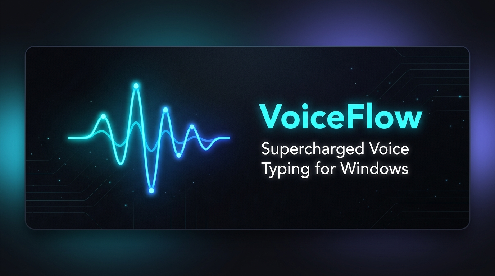
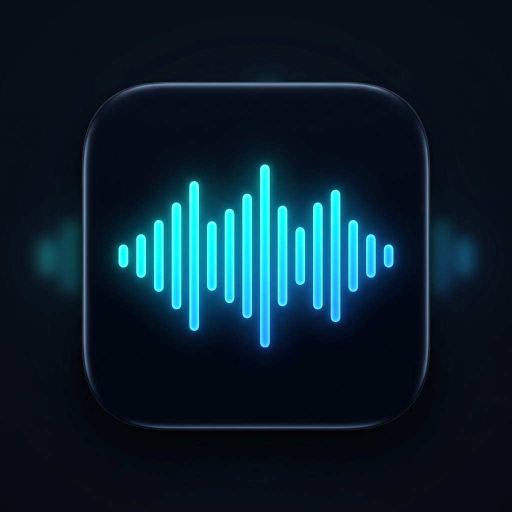
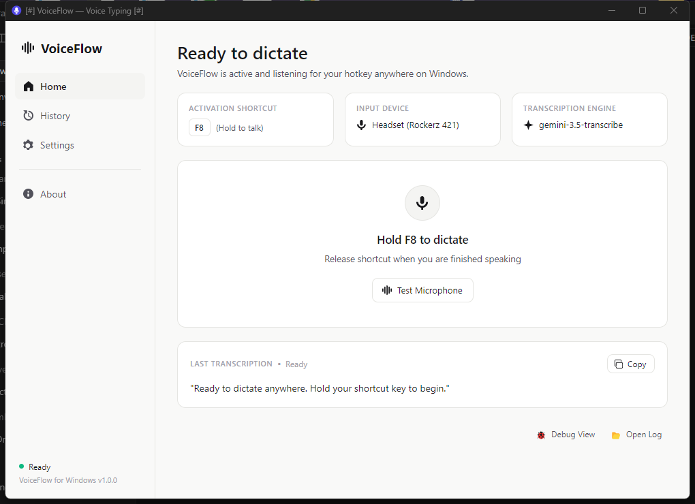
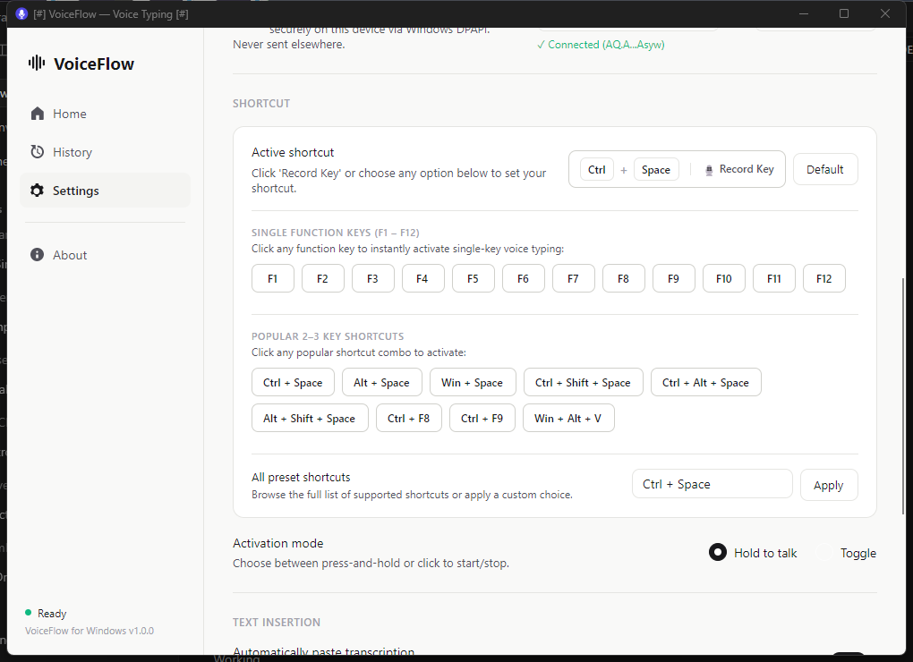
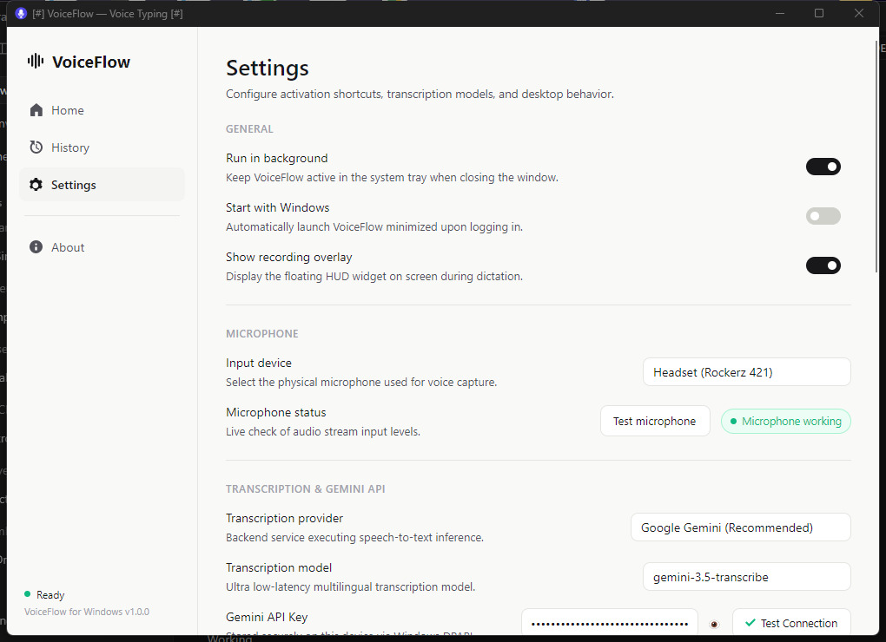
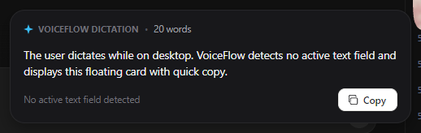
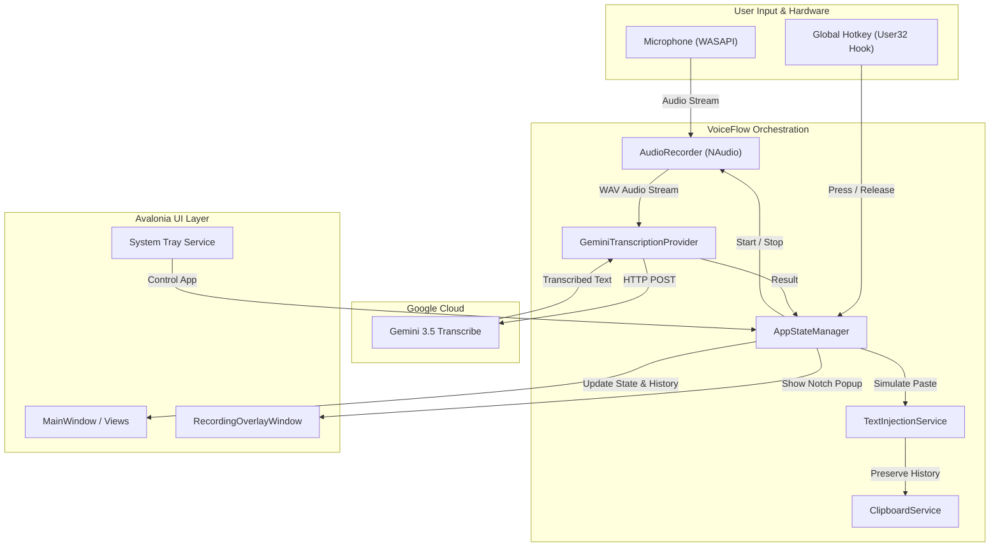

<p align="center">
  
</p>

<p align="center">
  
</p>

<h1 align="center">VoiceFlow</h1>

<p align="center">
  <strong>Next-Generation Voice Typing & Multilingual Dictation for Windows powered by Google Gemini 3.5 Transcribe.</strong>
</p>

<p align="center">
  <a href="https://dotnet.microsoft.com/download/dotnet/8.0"></a>
  <a href="https://avaloniaui.net/"></a>
  <a href="https://ai.google.dev/"></a>
  <a href="#"></a>
  <a href="LICENSE"></a>
  <a href="https://github.com/actions"></a>
</p>

---

## 🌟 Overview

**VoiceFlow** is a modern, ultra-low-latency desktop voice typing and speech-to-text assistant engineered for Windows. Powered by Google's state-of-the-art **Gemini 3.5 Transcribe** multimodal model and native Windows audio streaming, VoiceFlow enables seamless system-wide dictation directly into any application, code editor, browser, or chat window.

Whenever you trigger your global shortcut, VoiceFlow captures high-fidelity audio via WASAPI, streams it directly for fast transcription, and automatically pastes the result right where your cursor is located—all while preserving your previous clipboard contents. If no active text input is focused, VoiceFlow automatically summons an intelligent floating notch card displaying your text with an instant one-click copy button.

---

## ✨ Key Features

- ⚡ **Gemini 3.5 Transcribe Cloud STT**: Instant speech recognition across 100+ languages with exceptional punctuation accuracy, domain term handling, and background noise resilience.
- ⌨️ **Flexible Global Hotkeys**:
  - **Single Function Keys**: One-tap activation using `F1` through `F12`.
  - **Multi-Key Combinations**: Full support for 2-3 key combos like `Ctrl + Space`, `Alt + Space`, `Win + Space`, `Ctrl + Shift + Space`, `Win + Alt + V`, and more.
  - **Interactive Shortcut Recorder**: Click *Record Key* and press any custom key sequence on your keyboard to bind it instantly.
  - **Activation Modes**: Switch between seamless **Hold-to-talk** (push-to-talk) or **Toggle** (click to start / click to stop).
- 🪟 **Context-Aware Text Injection & Floating Notch HUD**:
  - **Direct Text Injection**: Injects transcribed text into the focused window using simulated input without overwriting the user's existing clipboard contents.
  - **Wispr-Style Floating Notch Card**: When dictating without a focused text field, VoiceFlow pops up an unobtrusive, elegant floating notch card showing transcription preview, word count, and a 1-click **Copy** button.
- 🎨 **Modern Fluent UI & Penpot Design System**:
  - Crafted with Avalonia UI 11 following clean typography, dark/light contrast, responsive layouts, and smooth animations.
  - Dedicated views for **Home**, **History**, **Settings**, and **About**.
- 🛡️ **Enterprise-Grade Security**:
  - API keys are encrypted at rest using Windows DPAPI (`CryptProtectData`), guaranteeing keys are stored safely and never written in plaintext.
- 🎙️ **Low-Latency WASAPI Audio Capture**:
  - Live audio meter and test utility for verifying microphone level and input latency before dictating.
- 🚀 **Background System Tray Agent**:
  - Closes to tray to keep memory footprint light; quickly access settings or trigger dictation from the taskbar notification area.

---

## 📸 Screenshots Gallery

| Home Dashboard | Shortcut Management |
| :---: | :---: |
|  |  |
| *Real-time status, active shortcut badge, and dictation prompt* | *Single function keys (F1-F12), combo chips, and key recorder* |

| Settings Panel | Floating Notch Card |
| :---: | :---: |
|  |  |
| *General toggles, microphone level test, and Gemini API setup* | *Unfocused input fallback card with word count and 1-click copy* |

---

## 📋 System Requirements

- **Operating System**: Windows 10 (version 19041 or higher) or Windows 11 (64-bit).
- **Runtime**: [.NET 8.0 Runtime](https://dotnet.microsoft.com/download/dotnet/8.0) (or use self-contained release executable).
- **Hardware**: Working microphone or headset (USB, 3.5mm, or Bluetooth).
- **Gemini API Key**: A free or paid API key from [Google AI Studio](https://aistudio.google.com/).

---

## 🚀 Quick Start

### 1. Download & Launch
Choose the package that best fits your workflow:
- 🚀 **Windows Installer (Recommended)**: Download **`VoiceFlow-v1.0.0-Setup.exe`** from [GitHub Releases](https://github.com/arunmauryaz/VoiceFlow/releases). Runs a quick setup wizard, creates Start Menu & Desktop shortcuts, and enables seamless system integration.
- 📦 **Portable ZIP**: Download **`VoiceFlow-v1.0.0-win-x64.zip`** from [GitHub Releases](https://github.com/arunmauryaz/VoiceFlow/releases), extract to any folder, and double-click `VoiceFlow.exe` to run anywhere without installation.

### 2. Enter Gemini API Key
1. In the VoiceFlow navigation sidebar, open **Settings**.
2. Scroll to **Transcription & Gemini API**.
3. Paste your Gemini API key from [Google AI Studio](https://aistudio.google.com/).
4. Click **Test Connection** to verify that your key is active and connected.

### 3. Choose Your Shortcut
1. In **Settings -> Shortcut**, pick your preferred hotkey:
   - Click any single function key chip (`F1` – `F12`), or
   - Click any popular combo chip (`Ctrl + Space`, `Alt + Space`, etc.), or
   - Click **Record Key** and press your favorite combination.
2. Choose your activation mode: **Hold to talk** or **Toggle**.

### 4. Dictate Anywhere!
- Focus any text field (VS Code, Slack, Word, Discord, Browser, Terminal, etc.).
- Press and hold your shortcut key, speak naturally, and release.
- VoiceFlow will transcribe and type your text in real time!

---

## 🛠️ Building From Source

### Prerequisites
- [.NET 8.0 SDK](https://dotnet.microsoft.com/download/dotnet/8.0)
- Visual Studio 2022 (v17.8+), JetBrains Rider, or VS Code with C# Dev Kit.
- Git

### Build Instructions

```powershell
# 1. Clone the repository
git clone https://github.com/arunmauryaz/VoiceFlow.git
cd VoiceFlow

# 2. Restore NuGet dependencies
dotnet restore VoiceFlow.sln

# 3. Build in Release configuration
dotnet build VoiceFlow.sln -c Release

# 4. Run all automated unit and component tests
dotnet test VoiceFlow.Tests/VoiceFlow.Tests.csproj -c Release

# 5. Publish a standalone, self-contained single-file executable
dotnet publish VoiceFlow/VoiceFlow.csproj -c Release -r win-x64 --self-contained true -p:PublishSingleFile=true -o ./publish
```

The published executable will be available at `./publish/VoiceFlow.exe`.

---

## 📂 Repository Structure

```text
WISPER-GEM/
├── .github/
│   └── workflows/
│       └── build.yml               # Automated CI build and test pipeline
├── docs/
│   ├── design/                     # Complete Penpot UI/UX design specifications
│   │   ├── 01 — Design System/     # Color palette, typography, tokens
│   │   ├── 02 — Components/        # Buttons, inputs, switches, cards
│   │   ├── 03 — Home/              # Home screen mockups and layout
│   │   ├── 04 — History/           # History screen and action menus
│   │   ├── 05 — Settings/          # Settings configurations
│   │   ├── 06 — Overlays/          # Floating HUD and notch cards
│   │   ├── 07 — Onboarding/        # First-run onboarding flow
│   │   └── 08 — About/             # About dialogue and system tray
│   └── screenshots/                # Application screenshots, logo, and banner
│       ├── banner.png              # High-res GitHub hero banner
│       ├── logo.png                # App icon / branding logo
│       ├── home.png                # Home dashboard screenshot
│       ├── settings.png            # Settings panel screenshot
│       ├── shortcuts.png           # Shortcut manager screenshot
│       └── floating_notch.png      # Floating notch popup card screenshot
├── VoiceFlow/                      # Core .NET 8 Avalonia Desktop Application
│   ├── Assets/                     # Application icons and vector assets
│   ├── Converters/                 # XAML value converters
│   ├── Helpers/                    # Hotkey formatters, audio waveform utilities
│   ├── Interfaces/                 # Architecture service contracts
│   ├── Models/                     # Data models, Enums, Settings structures
│   ├── Native/                     # Windows Win32 User32 / DPAPI pinvoke APIs
│   ├── Providers/                  # Audio recording and Gemini STT client
│   ├── Services/                   # Hotkey hook, clipboard, tray, state manager
│   ├── ViewModels/                 # MVVM view models (CommunityToolkit.Mvvm)
│   ├── Views/                      # Avalonia XAML views and overlay windows
│   ├── App.axaml                   # Application styles and DI initialization
│   ├── Program.cs                  # Entry point
│   └── VoiceFlow.csproj            # Project configuration
├── VoiceFlow.Tests/                # Automated Test Suite
│   ├── ComponentTests.cs           # ViewModels, converters, state machines
│   ├── FoundationTests.cs          # Models, hotkey parsing, crypto, DPAPI
│   └── VoiceFlow.Tests.csproj      # xUnit test project
├── .gitignore                      # Comprehensive Git ignore rules
├── LICENSE                         # MIT License
├── README.md                       # Repository documentation
└── VoiceFlow.sln                   # Visual Studio solution file
```

---

## 🏛️ Architecture & Subsystems



### Key Components

- **`WindowsHotkeyService`**: Uses a low-level keyboard hook (`SetWindowsHookEx`) to intercept global hotkeys without consuming system resources or blocking keystrokes.
- **`GeminiTranscriptionProvider`**: Communicates with the Google Gemini API using `gemini-3.5-transcribe` with optimal audio headers, low latency, and retry logic.
- **`WindowsTextInjectionService`**: Detects focused text controls via Win32 `GetGUIThreadInfo`. If an active caret is detected, it pastes text and restores the user's prior clipboard within 150 milliseconds.
- **`RecordingOverlayWindow`**: A lightweight topmost overlay rendering both the active microphone audio waveform during recording and the fallback popup card when unfocused.
- **`SettingsService`**: Manages user configuration in `%LocalAppData%/VoiceFlow/settings.json` with DPAPI encryption for credentials.

---

## 🧪 Testing

VoiceFlow includes an extensive automated test suite built with **xUnit**:

```powershell
dotnet test VoiceFlow.Tests/VoiceFlow.Tests.csproj
```

The test suite validates:
- Hotkey parsing, conflict detection, single-key F1-F12 validation, and combination formatting.
- Overlay state machine transitions and transcription popup timers.
- WASAPI and Gemini transcription provider response parsing.
- Settings persistence, validation, and DPAPI key encryption round-trips.
- Text injection and clipboard restoration logic.

---

## 🤝 Contributing

Contributions are welcome! Please follow these steps:

1. **Fork** the repository.
2. Create your feature branch (`git checkout -b feature/awesome-feature`).
3. Commit your changes (`git commit -m "Add awesome feature"`).
4. Run all tests to ensure zero regressions (`dotnet test`).
5. Push to your branch (`git push origin feature/awesome-feature`).
6. Open a **Pull Request**.

---

## 📄 License

This project is licensed under the **MIT License** - see the [LICENSE](LICENSE) file for details.

---

<p align="center">
  Built with ❤️ using <strong>.NET 8</strong>, <strong>Avalonia UI</strong>, and <strong>Google Gemini</strong>.
</p>
